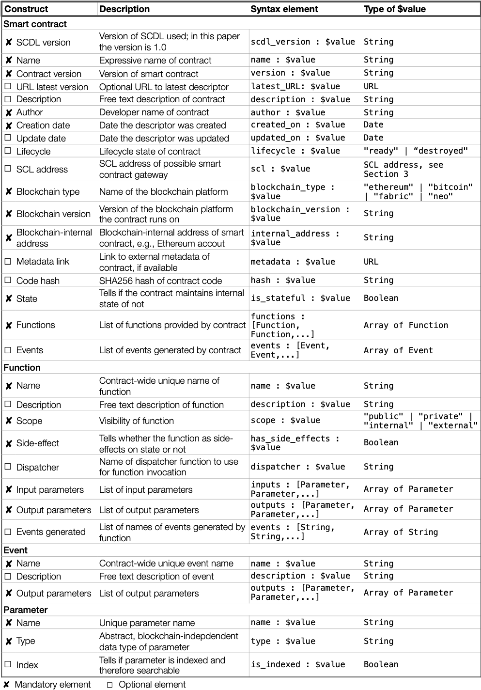

# `scdl-lib`

[](https://www.npmjs.com/package/@toolscip/scdl-lib)
[](https://www.npmjs.com/package/@toolscip/scdl-lib)


This library provides an programmatic way to interact with different smart contracts simply using their descriptors (i.e. [Smart Contract Description Language]()). The interaction is implemented with a [SCIP]() compliant communication, which is performed through the [scip-lib]() module.

## Table of Contents

- [Installation](#installation)
- [Usage](#usage)
- [SCDL Specification](scdl-specification)
- [Examples](#examples)
- [Contributing](#contributing)

## Installation

This package can be installed via [npm](https://www.npmjs.com/) as follow:

```bash
npm install --save @toolscip/scdl-lib
```

## Usage

In order to use this module you just have to import it like any other package:

_JavaScript_ import

```javascript
const scdl = require('@toolscip/scdl-lib');
```

_Typescript_ import

```typescript
import scdl from '@toolscip/scdl-lib';
// or
import { scdl } from '@toolscip/scdl-lib';
```

This package was mainly written to provide an automatic way to interact with smart contracts simply using their _SCDL-based_ descriptors. In order to do so the package simply provide a single class object `Contract` that must be instantiated providing a descriptor as parameter and then once instantiated the resulting object is a new one that exposes new properties, which are exactly named as its functions and events. These properties are instances of specific classes (i.e. `Method` and `Event` respectively) which allow a client to perform all allowed _SCIP_ requests (i.e. _invocation, subscription, unsubscription_ and _query_) by simply invoking the corresponding function on the property object (i.e. `invoke`, `subscribe`, `unsubscribe`, and `query`). All these function, since perform http requests, returns `AxiosResponse` promises.

```typescript
// import the 'Contract' class
import { Contract } from '@lampajr/scdl-lib';
// or using the package 'scdl.Contract'

const descriptor = {
  /*...*/
}; // scdl descriptor
const contract = new Contract(descriptor); // new contract instance
```

Now once you have created the `Contract` object, you can easily access its functions and events simply accessing the `methods` and `events` property respectively.

```typescript
contract.methods; // all contract's functions
```

```typescript
contract.events; // all contract's events
```

Suppose that you want to invoke a specific function (e.g. named 'send'), then you just have to use its name as property of the `contract.methods` object and then call the `invoke` [^1]function on it.

```typescript
// performs a SCIP invocation request
contract.methods.send
  .invoke(/*...*/)
  .then(res => {
    // ...
  })
  .catch(err => {
    // ...
  });
```

In addition this library provides an interface definition of an _SCDL descriptor_ object, which can be imported as follow:

```typescript
import { ISCDL } from '@toolscip/scdl-lib';
```

[^1]: In order to understand how to correctly invoke, subscribe, unsubscribe and query specific functions and/or events please refer to the [scip-lib](https://github.com/lampajr/toolscip/tree/master/packages/scip-lib) documentation, which fully describe the meaning of all required parameters.

## SCDL Specification

The following table defines each individual language construct in detail and equips it with a respective domain of possible values.



**Note**: a complete _SCDL_ specification can be found in the [scdl repository](https://github.com/floriandanielit/scdl).

## Examples

Given an _SCDL_ descriptor

```typescript
const model = {
  scdl_version: '1.0',
  name: 'Token',
  version: '^0.4.18',
  latest_url: '',
  author: '0xBfE4aA5c37D223EEBe0A1F7111556Ae49bE0dcD2',
  description: 'Contract token implementation following the ERC20 standars, the new created token is called ZIL',
  created_on: 'Jan-12-2018 09:44:42 AM +UTC',
  updated_on: 'Jan-12-2018 09:44:42 AM +UTC',
  scl:
    'http://localhost:3000?blockchain=ethereum&blockchain-id=eth-mainnet&address=0x05f4a42e251f2d52b8ed15E9FEdAacFcEF1FAD27',
  internal_address: '0x05f4a42e251f2d52b8ed15E9FEdAacFcEF1FAD27',
  blockchain_type: 'ethereum',
  blockchain_version: 'v0.4.18+commit.9cf6e910',
  metadata: 'https://etherscan.io/address/0x05f4a42e251f2d52b8ed15e9fedaacfcef1fad27#code',
  hash: 'b311edaec5a164050cede3219bf28cc6ce4c0ca43b8bf34d6fd309fb60c4d1d8  -',
  is_stateful: true,
  lifecycle: 'ready',
  functions: [
    {
      name: 'balanceOf',
      description:
        '* @dev Gets the balance of the specified address. @param _owner The address to query the the balance of. @return An uint256 representing the amount owned by the passed address.',
      scope: 'public',
      has_side_effects: false,
      inputs: [
        {
          name: '_owner',
          type: {
            type: 'string',
            pattern: '^0x[a-fA-F0-9]{40}$',
          },
        },
      ],
      outputs: [
        {
          name: '',
          type: {
            type: 'integer',
            minimum: 0,
            maximum: '2^256 - 1',
          },
        },
      ],
      events: [],
      dispatcher: '',
    },
  ],
  events: [
    {
      name: 'Transfer',
      description: 'Triggered when tokens are transferred',
      outputs: [
        {
          name: 'from',
          type: {
            type: 'string',
            pattern: '^0x[a-fA-F0-9]{40}$',
          },
          is_indexed: true,
        },
        {
          name: 'to',
          type: {
            type: 'string',
            pattern: '^0x[a-fA-F0-9]{40}$',
          },
          is_indexed: true,
        },
        {
          name: 'value',
          type: {
            type: 'integer',
            minimum: 0,
            maximum: '2^256 - 1',
          },
          is_indexed: false,
        },
      ],
    },
  ],
};
```

You can just create the contract object by simply using the _new_ keyword on the `Contract` class providing the descriptor as parameter.

```typescript
import { Contract } from '@toolscip/scdl-lib';

const contract = new Contract(model);

/* Retrieve the function object */
contract.methods.balanceOf;

/* Retrieve the event object */
contract.events.Transfer;
```

On these last objects (i.e. `Method` and `Event`) you can call perform all allowed _SCIP_ operations, such as invocation (only for methods), subscription, unsubscription and query.

```typescript
/* Invoke a method/function */
contract.methods.balanceOf.invoke(/*...*/)
	.then(res) {
    	// handle response
	}
	.catch(err) {
        // handle error
    };

/* Subscribe an event */
contract.events.Transfer.subscribe(/*...*/)
	.then(res) {
    	// handle response
	}
	.catch(err) {
        // handle error
    };
```

If you want to see a more complete example of usage please take a look at the [clisc](https://github.com/lampajr/toolscip/tree/master/packages/clisc), a Node.js command line interface, which was built for automating the _SCIP_ request invocations starting from an _SCDL_ descriptor.

## Contributing

Feel free to post questions and problems on the issue tracker. Pull requests are welcome!

Feel free to fork and modify or add new features and functionality to the library
